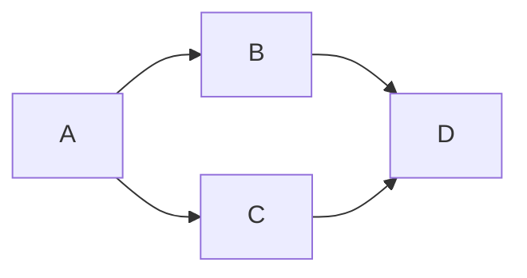
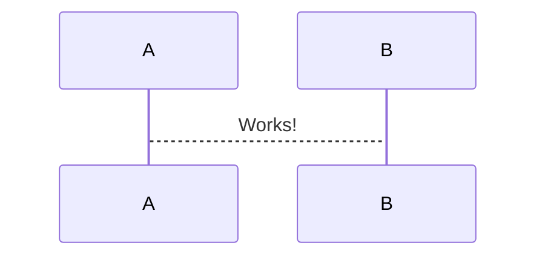

HTML tag
===

sequenceDiagram
A->>B:Query
B->>C:Fowasrd query
Note right of C:Thinking
C->>B:Response
B->>A:Forward response

HTML tag
===

  sequenceDiagram A-->B: Works!

Markdown fenced code
===

HUGO shortcodes
===
 sequenceDiagram A-->B: Works! 